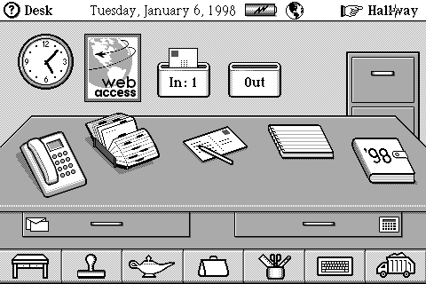
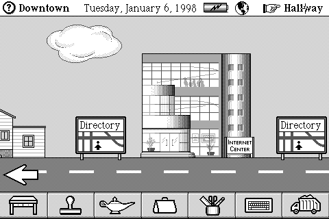
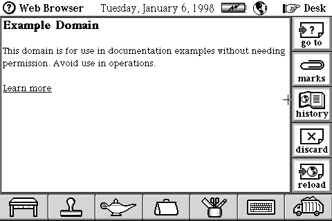
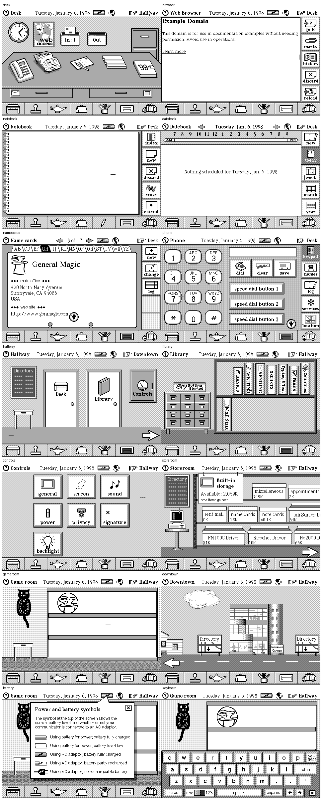

# Oki DataRover 840 for MiSTer

A MiSTer FPGA core for the Oki DataRover 840, the MIPS-based Magic Cap
communicator from 1997. It runs the device's own ROM as the hardware would:
a Toshiba TX3912 (R3900) CPU, its peripheral block, the 480x320 LCD, sound,
serial, two PC Card slots and 4 MB of battery-backed RAM.




Magic Cap boots, stays up, remembers what you put in it, takes memory cards,
installs software packages and browses the web through an emulated NE2000
network card.

## Installing

1. Copy `releases/DataRover840_YYYYMMDD.rbf` to `/media/fat/_Console/` on
   your MiSTer.
2. Put a DataRover 840 ROM image in `/media/fat/games/DataRover840/`. The ROM is
   not included: it is 4 MB, typically named `DataRover-840-USA.image`.
   Rename it to `.rom` (the MiSTer's file browser only matches
   three-letter extensions; `.rom`, `.ima` and `.bin` are accepted). The
   Japanese ROM and the Magic Cap "Rosemary" SDK ROM also run.
3. Start the core from the Console menu and pick the ROM with **Load ROM**.

The core remembers the last ROM loaded, so starting it again brings back the
same machine with its saved RAM.

To launch a ROM directly from the menu, add an `.mgl` beside the core, e.g.
`/media/fat/_Console/DataRover 840 (USA).mgl`:

```xml
<mistergamedescription>
<rbf>_Console/DataRover840</rbf>
<file delay="1" type="f" index="1" path="DataRover-840-USA.rom"/>
</mistergamedescription>
```

## Controls

| Input | Does |
|---|---|
| Mouse | The pen: moves a crosshair; left button touches, right button touches with the option key held |
| Joystick | The pen too: stick moves, **A** touches, **B** touches with option, **Start** is the ON button |
| Keyboard | A Magic Bus keyboard; **F4** is the ON button |

Calibrate the screen when Magic Cap asks; the touches go where the crosshair is.

## Saving

The 4 MB of RAM holds everything you have done in Magic Cap. It is saved as
`saves/DataRover840/<rom>.sav`:

- when Magic Cap turns the machine off,
- on **Save state** in the OSD,
- when the OSD opens, if **Autosave on OSD** is on (off by default).

A save also keeps the CPU and peripheral state, so loading it picks up exactly
where it left off. A save or load pauses the machine for about two seconds,
with a progress bar on the panel. **System → Start fresh** resets into
cleared RAM. The next save then replaces your saved RAM file.

## The OSD

The main page holds the ROM, RAM image, both card slots' images, **Install
package**, **Save state** and **Autosave on OSD**. Settings are on pages:

- **Card slots**: Slot 1 holds a memory card, the network card or nothing;
  slot 2 a memory card or nothing. **Re-insert** takes a card out and back
  in with the option key held, which is how Magic Cap formats a blank one.
- **Display**: the panel at 480x320 (3:2, for the MiSTer scaler) or 640x480
  in a bezel; black and white, grey STN or green LCD colours.
- **Power**: AC adaptor with a battery (default), AC adaptor alone, or
  battery; what happens after Magic Cap's idle power-off; a Power button.
- **Packages**: the package link's speed (4x by default) and re-offering a
  package.
- **System**: keyboard, booting to the IDT monitor, Start fresh.

For a sharper LCD look, the files in `shadow_masks/` go in
`/media/fat/Shadow_Masks/` and pair with the 3x or 4x integer scale in the
MiSTer video settings.

## Memory cards

A card is a raw image of its common memory, the same format the reference
emulator uses, so cards move between the two as files. Mount an image for a
slot from the OSD, and the card shows up as a shelf in the Storeroom. To make a blank one, run
`scripts/mkcard`, mount it, then use the slot's **Re-insert** entry.

## Installing software

Magic Cap software comes as `.pkg` (and `.mc2`) packages, normally sent from
a PC running WinPcLink. Here the OSD plays the PC:

1. **Install package** and pick the file.
2. In Magic Cap, go to the Storeroom and tap the computer.
3. "Receiving Package" fills its bar, and the package lands on the shelf.

## Networking

Slot 1 can hold an NE2000 Ethernet card. Its traffic passes through the
MiSTer's Linux onto your local network, and Magic Cap's Web Browser can
fetch plain HTTP pages (it has no TLS).



1. Build the setup script with `scripts/mknetsh`. Copy the resulting
   `DataRover Network.sh` to `/media/fat/Scripts/` and run it once from
   the Scripts menu. It installs a small daemon that starts at every boot
   (`--remove` undoes it).
2. Install the **WCPack** and **Ne2000** packages (plus **MagicJavaScript**
   and **WebBrowser40** for the browser) with **Install package**.
3. Set **Card slots → Slot 1** to **Network card**.
4. In Internet Center's setup, give the Ne2000 LAN connection a free
   address on your network, with your router as DNS.

## Screenshots



## Building

```sh
quartus_sh --flow compile DataRover840     # output_files/DataRover840.rbf
scripts/deploy [mister-host] [USA|Japan|SDK]
```

Quartus 17 (Lite) targets the DE10-Nano. `scripts/deploy` copies the core,
ROMs, packages, network daemon and shadow masks to a MiSTer over SSH and
loads the core.

How the core was built and validated (lockstep against a reference emulator
over ten million instructions, the clocking, SDRAM, caches and peripherals)
is written up in [docs/DEVELOPMENT.md](docs/DEVELOPMENT.md).
